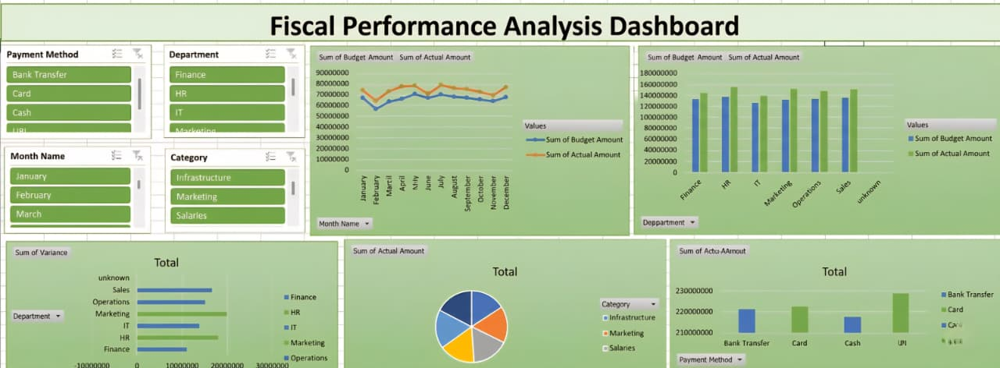

# Fiscal-Performance-Analysis-Dashboard

## 📌 Overview
The Financial Budget vs Actual Dashboard is an interactive data visualization project built to compare planned budgets with actual spending across different departments, categories, and payment methods.

This dashboard helps organizations:
- Track financial performance
- Identify overspending or underspending
- Make data-driven budgeting decisions

---

## 🎯 Objectives
- Compare Budget vs Actual Amounts
- Analyze spending trends over time
- Evaluate department-wise financial performance
- Understand category-wise and payment method usage
- Identify variance in financial planning

---

## 🛠️ Tools & Technologies
- Microsoft Excel
  - Pivot Tables
  - Pivot Charts
  - Slicers
  - Data Cleaning
---

## 📊 Dashboard Features

### 🔎 Filters (Slicers)
- Payment Method  
- Department  
- Month  
- Category  

---

### 📈 Monthly Trend Analysis
- Line chart comparing:
  - Budget Amount
  - Actual Amount  
- Helps identify monthly fluctuations

---

### 🏢 Department-wise Comparison
- Bar chart showing:
  - Budget vs Actual per department  
- Useful for performance evaluation

---

### 📉 Variance Analysis
- Highlights:
  - Over-budget departments
  - Under-budget departments  

---

### 🥧 Category Distribution
- Pie chart showing expense distribution:
  - Infrastructure
  - Marketing
  - Salaries  

---

### 💳 Payment Method Analysis
- Comparison of spending via:
  - Bank Transfer
  - Card
  - Cash
  - UPI  

---

## 📌 Key Insights
- Identify departments exceeding budget
- Track consistent overspending patterns
- Understand major cost-driving categories
- Analyze preferred payment methods

---

## 🚀 How to Use
1. Open the Excel file
2. Use slicers to filter data
3. Interact with charts for insights
4. Analyze trends and make decisions

---

## 📈 Future Improvements
- Add forecasting (next month/year prediction)
- Integrate with Power BI
- Automate using Python
- Add KPI indicators (Savings %, Profit)

---
